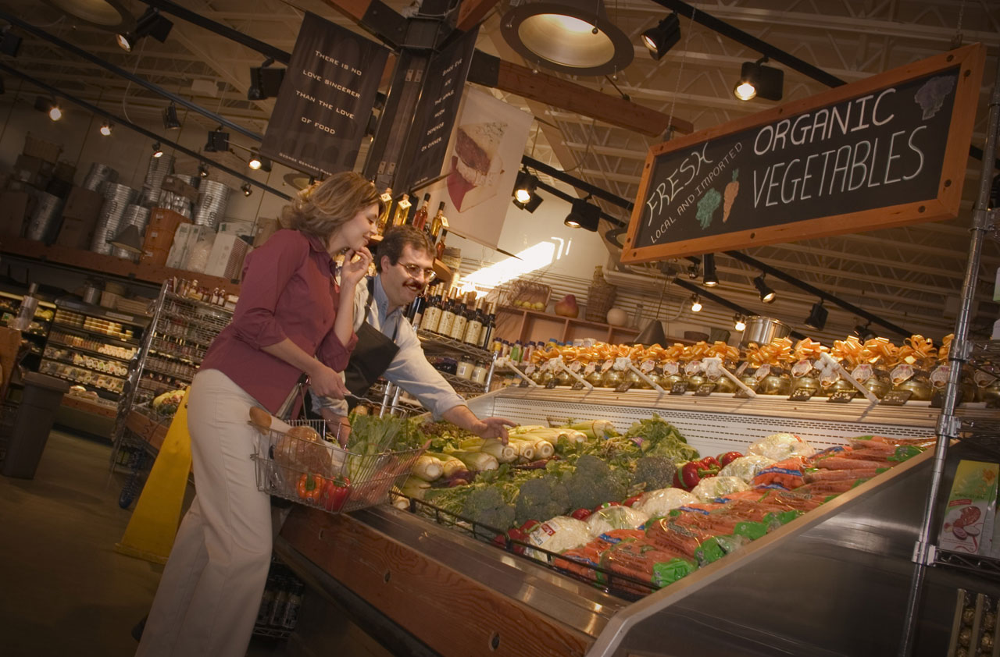

# Predicting Organic Food Purchases with Consumer Characteristics  
  

## Problem Definition

As organic options garner ever-increasing popularity from consumers, grocery stores need to understand the implications of this increased demand. These stores will want to know which market segments have a higher propensity to purchase organic items so they can more effectively target ads and coupons to the proper consumers. 

## Data Set

The data set consists of 15,401 customers that are enrolled in a UK grocery chain’s loyalty program. Each of the customers received a coupon for a new line of organic produce, and the chain monitored whether customers purchased any of these organic products by tracking purchases via each customer’s loyalty ID. Through their loyalty enrollment, the chain held demographic data on these consumers including: gender, age, affluence, geographical region, TV region, loyalty level (Tin, Silver, Gold, or Platinum), as well as how long they had been a loyal customer with the chain. 

In this analysis we investigate notable trends between customer demographics and propensity to purchase organic products, and then conduct a comparison of classification models to make a prediction on whether a consumer has a high likelihood of purchasing organics.

## Data Exploration

Of the 15,401 customers who received coupons, 4,383 actually ended up purchasing an organic product from the newly introduced line. This gives an overall purchase rate of 28.459%. However, this purchase rate is very much demographic dependent. We can first explore some of the basic relationships between some of the predictors in the data and the propensity to purchase organic products. 

**Figure 1: Buys vs No Buys**  

Age contributes greatly to whether a customer will purchase organics. One might imagine that younger consumers are more likely to be health-conscious and in touch with environmental issues, and thus more likely to purchase organics. This suspicion is confirmed as we look at Figure 2. From this histogram we can see that in the age group of 20-45, a relatively high percentage of consumers purchased organics, with a steep drop-off at age 45. Organic purchase rates after age 45 are consistently low. The purchase rate disparity between these two groups is substantial: 56.88% of consumers under 45 purchased one of the newly introduced organic products while only 17.72% of those over 45 made a purchase.  

  
**Figure 2:Purchasing Decisions Made Among Age Groups**  

Affluence, as measured on a logarithmic scale from 0-34 with 8 equating to median income, also seems to play a significant role in whether a consumer will purchase organic products. Presumably organics are slightly more expensive than their non-organic counterparts, leading more affluent consumers to purchase organics at a higher rate. We can see this visually in Figure 3, which shows that consumers with affluence levels above median income (10 or above) are much more likely to purchase organics than those with affluence levels at or below median income. 

  
**Figure 3:Change in Purchases With Respect To Affluence Level**  

Gender is also one of the key factors that appears to contribute to whether a consumer will purchase organics. As we can see in Figure 4, closed to 80% of organic buyers are females. When facing the option to purchase organics, a higher percentage of females as opposed to male consumers would be willing to purchase organic products.  

  
**Figure 4: Purchasing Decisions Made By Females and Males**  

## Model Comparison

In an effort to predict which consumers are likely to purchase organic products, we can compare three different classification models: logistic regression, k-nearest neighbors, and classification trees. When evaluating the accuracy of each of these models on a test data set, we can keep in mind the baseline organic purchase rate is 28.459%. A model that used the basic heuristic that no one will purchase organics would thus have an accuracy of 71.541%, while a predictive classification model should reasonably be able to improve upon this accuracy. 

### Logistic Regression

In our logistic regression model, we take into account all predictors, including: age, gender, region, TV region, affluence, loyalty level, and loyalty tenure. First, we scale and center our data. From our logistic regression model, we calculate the accuracy on the training data set is 78.44%, while the accuracy on the testing data set is 79.31%. Since the training accuracy and testing accuracy is pretty close, we can confirm the logistic regression model has the correct accuracy level. 

We can quickly look at the coefficients of our logistic regression model. Although these coefficients are not easily interpretable after the data has been scaled, they can still be used as a crude basis for variable importance in the model’s prediction. This is shown visually in Figure 5. We can see that affluence, age, gender and loyalty status hold the most importance in our logistic regression model, respectively. 

  
**Figure 5:Feature Importance From Logistic Regression**  

### K-Nearest Neighbors

To build our k-nearest neighbors model, we are faced with the task of choosing an optimal value of k. To do this, we conduct cross validation for values of k between 1 and 300. For each value in this range, we fit a KNN model with all of our predictors to predict purchases of organic products.

On each model, we conduct 3-fold cross validation, each time computing the average model accuracy on 4,621 test data observations. The model accuracies from this cross-validation process can be shown in Figure 6. We can see that out-of-sample test accuracy increases as we increase the value of k up to a certain threshold and then quickly falls off (only k values from 0 to 200 shown). We find the optimal value to be k=90, which leads to a model accuracy just above 80% when predicting on test data:

KNN model: 80.047% accuracy when predicting on test data. 

This accuracy level makes a significant improvement upon the 71.541% accuracy that we would get from a simple heuristic rule.  

  
**Figure 6:Cross-Validation For KNN**  

With our chosen KNN model, we can look at the importance of each variable for prediction. This measure can be seen visually in Figure 7. As expected, age and affluence seem to play by far the largest role in whether a consumer will purchase organics, followed by loyalty card tenure (how long they have been a loyal customer), and gender.  

  
**Figure 7: Feature Importance From KNN**  

### Classification Trees

Next we can investigate the predictive accuracy of a Decision Tree Model. We start by training a simple tree model using the train data set and obtain a complicated model with a depth of 35. This natural tree model has an impressive performance when doing prediction on train data with an in-sample accuracy rate of 98.87%. However, when it comes to predicting based on test data, its out-of-sample accuracy rate goes down to 71.43%, which is even lower than the baseline accuracy level of 71.541%. where you simply predict that no one will buy the organics. 

The disparity between in-sample and out-of-sample accuracy rate of the natural tree model shows that it suffers a lot from overfitting. To solve that, we conduct a five-fold cross validation on a range of tree depth from 1 to 10 (See Figure 8) to find out the optimal one which minimizes the effect of overfitting. The result shows that the first dip in cv-average-score appears when the tree depth grows from 4 to 5, from there we can determine the optimal tree depth to be at 4. Although the pruned tree model with depth=4 performs worse when predicting on training data compared to the natural tree’s, with an accuracy rate of 79.40%, it has a higher out-of-sample accuracy rate of 78.99%. The tiny distance (lower than 1%) between the in-sample and out-of-sample accuracy rates of the pruned tree shows that it largely gets rid of the effect of overfitting. Therefore the prediction outcome from the pruned tree is relatively reliable. 

  
**Figure 8: 5-Fold Cross-Validation For Classification Trees**  

From the pruned tree we can learn that age, affluence grade and gender are the three variables with main effects in classification trees (See Figure 9). We can observe that the variable importances are slightly different between KNN and decision trees, where loyalty card tenure shows more effect in prediction from KNN than from decision trees. One way we could explain the difference is that the algorithms for the variable importance measurements of the two models are different. For KNN we used permutation feature importance while for Tree Model we used CART Classification Feature Importance. 

  
**Figure 9:Feature Importance From the Pruned Tree**  

We take a basic visual look of how the pruned tree model classifies customers by their features and predicts whether they will purchase organics or not. 

  
**Figure 10:Decision Structure of the Pruned Tree**  

### Chosen Model  

We can now compare the out-of-sample test accuracies of each of the models discussed above:  

●	KNN: 80.047% 
●	Logistic Regression: 79.31%
●	Decision Trees: 78.99%

We can see that all three models give a similar accuracy measure. However, given the best accuracy of the three models at  80.047%, we can choose KNN with k=90 as our most accurate classification model. 

We can look at the confusion matrix of the KNN model’s predictions in Table 1. Of the 4,621 test set data points, 3,625 are classified correctly. Of the 996 misclassifications on the test data, 675 are false negatives (Type II error) while 321 are false positives (Type I error). In other words, the majority of the model’s mistakes are when it guesses a consumer will not purchase organic products when they actually do. 

  
**Table 1:Confusion Matrix of Predictions Made By KNN**  

## Conclusion

There are some clear trends between certain customer demographics and propensity to purchase organic products. When taking into account a UK customer’s age, gender, affluence, region, TV region, loyalty level and loyalty tenure, we can greatly improve our prediction accuracy of whether they will purchase organics. 

Although all three models produce slightly different weights of variable importance, they each have similar accuracy measures when predicting on test data. Of all the classification models evaluated, a k-nearest neighbors model with k=90 gives us the highest accuracy, at just over 80%. Age, affluence, and gender play particularly important roles in determining the likelihood that each consumer would make a purchase. 

Given this information on which consumers might be more likely to purchase organic products, a grocery chain could more easily target coupons and advertisements to certain market segments. In the case of organic products, this grocery chain might put more advertising effort towards customers that tend to be younger, female, and more affluent.

## Appendix
	
**Figure 1:**
		

**Figure 2:**
	

**Figure 3:**
	

**Figure 4:**
	

**Figure 5:**
	

**Figure 6:**
	

**Figure 7:**
	

**Figure 8:**
	

**Figure 9:**
	

**Figure 10:**
	

**Table 1:**
	

